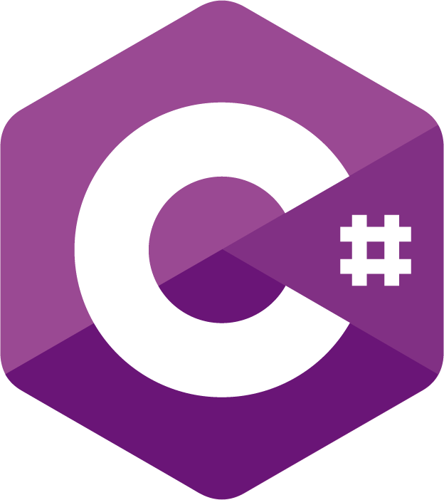

<!--suppress HtmlDeprecatedAttribute -->
# Hey👋, This is Md. Arafat Hossain  #

 
- 🔭 Full-stack developer with 1 years of experience designing and building scalable, high-performance web, and desktop applications 
- 🌱 Proficient in front-end technologies like React JS, Razor  as well as back-end technologies like Spring Boot, ASP.NET Core, Node.js, and PHP 
- Experienced in developing financial systems,Laboratory Information system for clinical instruments 
- Developed and trained some machine learning model 
- Deep knowledge about deep learning, Generative AI, recommendation system and reinforcement system. 

# Main Skills #

 
 

# 💻 My favorite tools and technologies

<table align="center">
  <>
    <td align="center" width="96">
        
       React JS
    </td>
    <td align="center" width="96">
      
       Python
    </td>
    <td align="center" width="96">
        
       JavaScript
    </td>
    <td align="center" width="96">
        
       MySQL
    </td>
    <!-- <td align="center" width="96">
        
       TypeScript
    </td> -->
    <!-- <td align="center" width="96">
        
       AWS
    </td>   -->
     <td align="center" width="96">
        
       PHP
    </td>
    <td align="center" width="96">
        
       VsCode
    </td>
  </tr>
  <>
    <td align="center" width="96">
        
       Github
    </td>
    <td align="center" width="96"> 
        
       Git
    </td>
    <td align="center"  width="96">
        
       HTML5
    </td>
    <td align="center" width="96">
        
       CSS
    </td>
    <td align="center"  width="96">
        
       Bootstrap
    </td>
    <!-- <td align="center" width="96">
        
       Tailwind
    </td> -->
      <!-- <td align="center" width="96">
        
       MongoDB
    </td> -->
        <td align="center" width="96">
        
       Nodejs
      </td>
            
            
 </tr>
</table>
  

<!-- activity graph heroku-app start -->

    

<!-- activity graph heroku-app end -->

# Reach out to me #

To contact me.
arafat.hossain.17050@gmail.com

# Welcome!

## My personal values and work ethic
✨ I want to build strong relationships with my team members.

✨ I believe that a good working relationship is built on mutual trust and respect.

✨ I value open communication.

✨ I am a team player and enjoy collaborating with others to achieve a common goal.

✨ Outside of work, I am an avid sports fan, especially when it comes to football.

✨ I enjoy learning new technologies and am constantly seeking opportunities to expand my skillset.

✨ Preferred PHP frameworks ✔Laravel, ✔Codeigniter
       
✨ Preferred Python frameworks   ✔Django, ✔Flask
          
✨ Preferred JS frameworks   ✔TypeScript, ✔React.js, ✔Vue.js
         
✨ Preferred style frameworks  ✔Bootstrap, ✔Material-UI
         
✨ Database options   ✔Oracle, ✔MySQL, ✔PostgreSQL, ✔MSSQL, ✔MongoDB        

   
  

## Languages and Tools  

  
  
  
  
  
  
  
  
  
  
  
  
  
  
  
  
  
  
  
  
  
  
  
  
  
  
  
  
  
  
  
  
  
  
  
  
  
  
  
  
  
  
  
  
  
  
  
  
  
  
  
  
  
  
  
  
  
  
  
  
  
  
  
  
  

  

   

<!-- # Do you want to see my past work?
## Trademarktoday Business Website

## InvestFarmLand Business Website

## Google Map API Delivery Site

## Social Media Posting Website like Twitter

## Freelancer Account Creating Bot

## Theme & Dashboard
 -->
